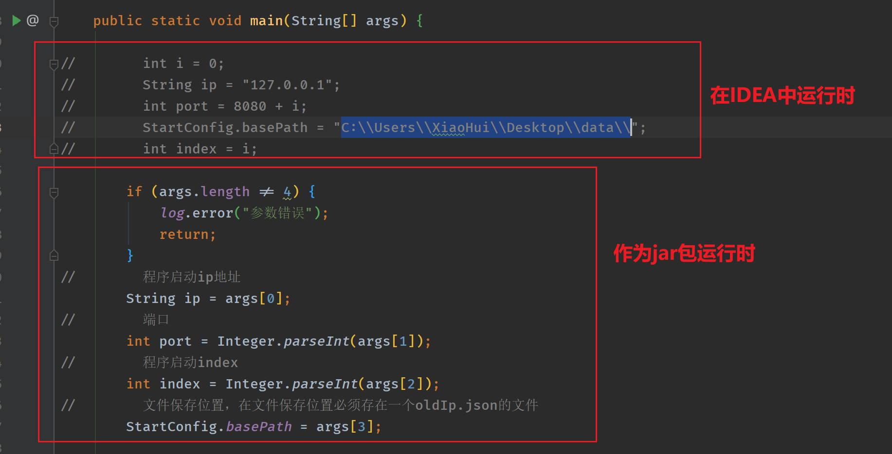
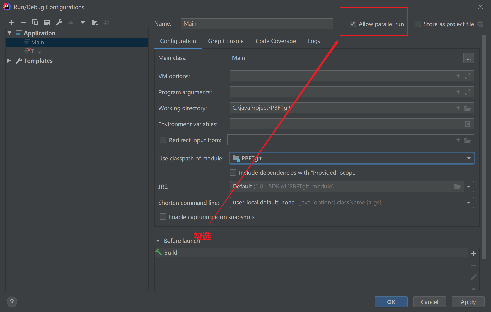
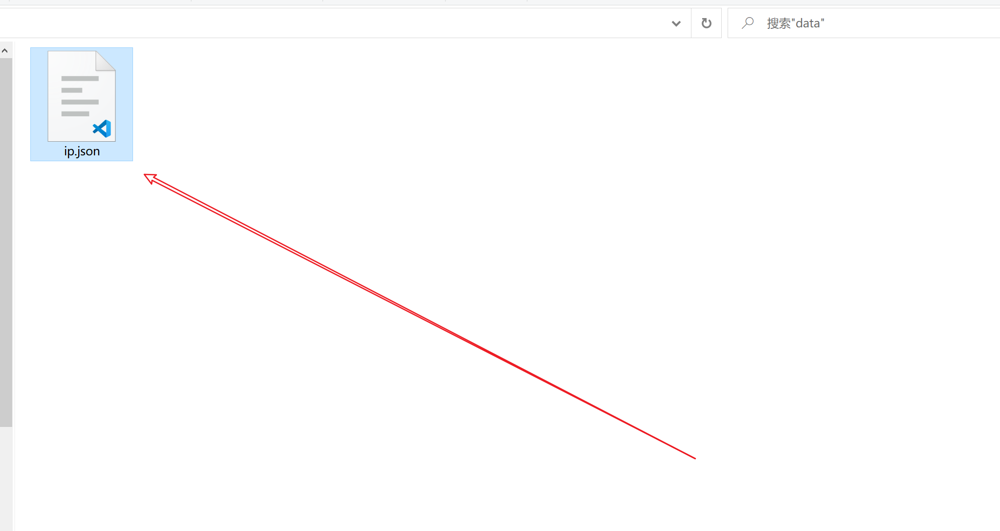
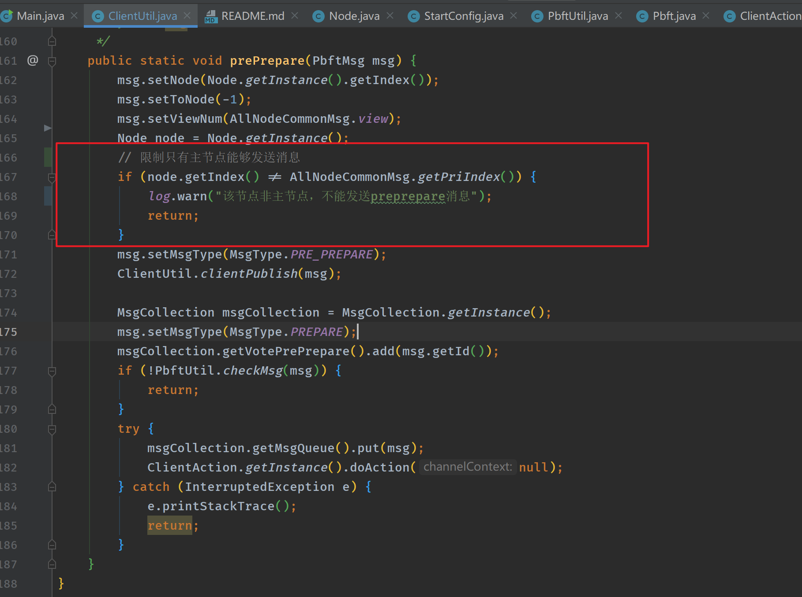

# **项目必须和另一个pbft-agent一起使用**

# 具体有什么问题或者进一步想法的同学可以关注公众号 **CppCoding** 联系我
关于代码介绍方法，可以去看[博客](https://www.cnblogs.com/xiaohuiduan/category/1635542.html)。里面介绍了一些功能的实现思路和方法，以及使用到的一些库的介绍。


关于代码介绍方法，看[博客](https://www.cnblogs.com/xiaohuiduan/category/1635542.html)。里面介绍了一些功能的实现思路和方法，以及使用到的一些库的介绍。

- [PBFT && RBFT算法流程](https://www.cnblogs.com/xiaohuiduan/p/12210891.html)
- [t-io Java构建p2p网络](https://www.cnblogs.com/xiaohuiduan/p/12302024.html)
- [PBFT算法java实现](https://www.cnblogs.com/xiaohuiduan/p/12339955.html)
- [PBFT 算法 java实现（下）](https://www.cnblogs.com/xiaohuiduan/p/12359271.html)


# 使用方法


然后使用命令生成jar包

```bash
mvn package
```

## 运行方法

在**IDEA运行**着将第二块区域进行注释（第一块区域不要注释），使用jar包运行则将第一块区域进行注释（第二块区域不要注释）


下图是创建代理节点，注意端口不能与共识节点重复


### master包运行方法
master包是共识节点
```bash
java -jar 包名 ip地址 端口号 序号 文件保存位置
```

- ip地址和端口号代表节点作为server需要占用ip和端口号
- 序号：节点的序号，必须独一无二
- 文件保存位置


### agent包运行方法
agent包是代理节点，用来接收请求（目前没有很明确的前端请求，用发送消息代替）
例如：

```bash
java -jar pbft-agent.jar 127.0.0.1 8080 0 C:\\Users\\XiaoHui\\Desktop\\data\\
```

因此，你可以在本机上运行多个节点（保证端口号和序号不同即可）。

### 在IDEA中运行的方法

首先配置启动，允许多个main执行



然后，每次启动一个节点，更改 `i` 就可以启动不同的节点。

```java
int i = 0;

```

# 注意点


1. 程序会自动新建一个json文件，里面保存节点的ip信息，`StartConfig.basePath`代表json文件保存位置。

   
   
   


2. 如果结束所有节点，然后重新启动程序，需要将`ip.json`中的内容全部删除。（比如说你启动了1节点，2节点，然后你关闭了这个程序，又想重新启动1节点2节点就必须删除）,否则会报错，如下图所示：

   
   
3. 只有主节点能够发送消息，其他节点会发送消息失败。如何想使用非主节点发送消息，可以去修改代码。如下图所示：将红框内的代码注释即可。


